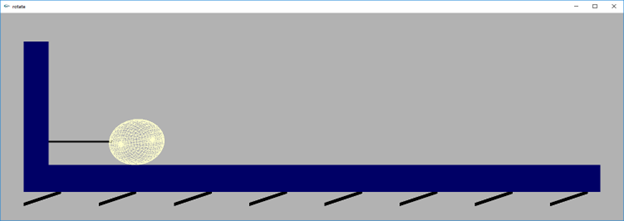
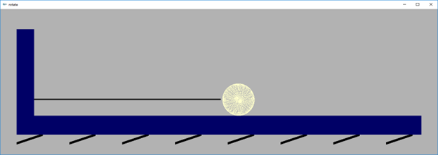

# 3D Animation of Ball on a Spring

This project demonstrates a 3D animation of a ball oscillating on a spring using OpenGL. The simulation visualizes the ball's motion and rotation as it moves along the spring, providing an engaging visual effect.

## Code Overview

The provided code uses OpenGL to render a 3D scene consisting of a spring and a ball. The ball moves in a sinusoidal path along the spring and rotates around its axis. The animation is controlled by updating the ball's position and rotation angle over time.

### Key Components

- **`initRendering`**: Initializes rendering settings, enabling depth testing.
- **`handleResize`**: Adjusts the viewport and projection matrix when the window is resized.
- **`drawScene`**: Clears the screen, draws the spring and the ball, and updates the ball's position and rotation.
- **`update`**: Updates the rotation angle of the ball and triggers a redraw of the scene.

## Results

The animation visualizes the dynamics of a ball oscillating on a spring. The following images show the progression of the simulation:

### Step 1

### Step 2

### Step 3

These images illustrate the ball's motion along the spring and its rotation as rendered by the simulation.

## Dependencies

- OpenGL
- GLUT (OpenGL Utility Toolkit)

## Usage

1. Compile the code using an OpenGL-compatible compiler.
2. Run the executable to see the animation of the ball on the spring.
3. Observe the generated images to analyze the ball's oscillatory and rotational dynamics.
